# Auto-Evaluator Deployment Documentation

**Date:** 2025-12-24
**Status:** ✅ LIVE IN PRODUCTION
**Mode:** Human-Approval Required
**Author:** Claude + Louis

---

## 📋 Executive Summary

Successfully deployed an **automatic evaluation system** for WhatsApp Monitor drops that:
- Runs every 5 minutes via cron job
- Automatically evaluates new drops when photos are available
- Requires human approval before sending feedback (safer approach)
- Completely non-breaking addition to existing systems

---

## 🏗️ System Architecture

### Components Deployed

```
┌─────────────────────────────────────────────────────────┐
│                   CRON JOB (Every 5 min)                │
│                 /scripts/auto-evaluator-cron.sh         │
└────────────────────┬────────────────────────────────────┘
                     ↓
┌─────────────────────────────────────────────────────────┐
│              AUTO-PROCESS API ENDPOINT                   │
│              POST /api/foto/auto-process                 │
├─────────────────────────────────────────────────────────┤
│ 1. Query new drops from qa_photo_reviews                │
│ 2. Check each drop for photos on BOSS API               │
│ 3. Run batch evaluation if photos exist                 │
│ 4. Save results to foto_ai_reviews                      │
│ 5. Log stats to foto_auto_processor_state              │
└─────────────────────────────────────────────────────────┘
                     ↓
┌─────────────────────────────────────────────────────────┐
│                  HUMAN REVIEW REQUIRED                   │
│                    /foto-review Dashboard                │
├─────────────────────────────────────────────────────────┤
│ • Agent sees auto-evaluated drops                       │
│ • Reviews AI evaluation (7/10 steps passed, etc)        │
│ • Clicks "Send Feedback" if appropriate                 │
└─────────────────────────────────────────────────────────┘
```

---

## 📁 Files Created/Modified

### New Files (Safe Additions)

| File | Purpose |
|------|---------|
| `src/modules/foto-review/services/autoEvaluator.ts` | Core auto-evaluation service |
| `pages/api/foto/auto-process.ts` | API endpoint for cron job |
| `scripts/auto-evaluator-cron.sh` | Cron script (calls API every 5 min) |
| `scripts/db/create-auto-processor-state-table.sql` | Database migration |
| `docs/AUTO_EVALUATION_ARCHITECTURE.md` | Technical design document |
| `docs/AUTO_EVALUATOR_SETUP.md` | Setup instructions |
| `docs/AUTO_EVALUATOR_DEPLOYMENT.md` | This deployment record |

### Modified Files (Minor Changes)

| File | Change |
|------|--------|
| `src/modules/foto-review/services/fotoVlmService.ts` | Added exports: `fetchDrPhotos`, `QA_STEPS` |

---

## ⚙️ Configuration

### Environment Variables (Production)

```bash
# /var/www/fibreflow/.env.production
AUTO_EVALUATOR_ENABLED=true           # System is ON
AUTO_EVALUATOR_DRY_RUN=false         # Live mode (real evaluations)
AUTO_EVALUATOR_SEND_FEEDBACK=false   # Human approval required ✅
USE_WHATSAPP_FEEDBACK=true           # WhatsApp enabled (for manual)
```

### Cron Job

```bash
# Root crontab on 72.60.17.245
*/5 * * * * /var/www/fibreflow/scripts/auto-evaluator-cron.sh

# Runs at: :00, :05, :10, :15, :20, :25, :30, :35, :40, :45, :50, :55
```

### Database

```sql
-- New table: foto_auto_processor_state
-- Tracks processing statistics
CREATE TABLE foto_auto_processor_state (
  id INTEGER PRIMARY KEY DEFAULT 1,
  last_processed_timestamp TIMESTAMPTZ,
  last_run_at TIMESTAMPTZ,
  processed_count INTEGER,
  error_count INTEGER,
  last_error TEXT,
  created_at TIMESTAMPTZ,
  updated_at TIMESTAMPTZ
);
```

---

## 🔄 Process Flow

### Automatic Phase (Every 5 Minutes)

```mermaid
flowchart TD
    A[Cron Trigger] -->|Every 5 min| B[Query New Drops]
    B --> C{Photos Available?}
    C -->|No| D[Skip - Retry Next Run]
    C -->|Yes| E[Fetch Photos from BOSS]
    E --> F[Run VLM Evaluation]
    F --> G[Save to Database]
    G --> H[Update Stats]
    H --> I[⚠️ STOP - Wait for Human]
```



### Human Review Phase


---

## 📊 Current Performance

### Test Run Results (2025-12-24)

```json
{
  "total_processed": 10,
  "successful": 0,
  "failed": 10,
  "reason": "Photos not yet available on BOSS API"
}
```

**Note:** 0% success is expected initially as recent drops don't have photos uploaded yet. System will automatically process them when photos become available.

### Expected Performance

| Metric | Value |
|--------|-------|
| Processing Frequency | Every 5 minutes |
| Max Drops per Run | 10 |
| Evaluation Time | ~30-60 seconds per drop |
| Photo Availability Lag | 1-24 hours (from field to BOSS) |
| Human Review Time | ~30 seconds per drop |

---

## 🛡️ Safety Features

1. **Human Approval Required**
   - `AUTO_EVALUATOR_SEND_FEEDBACK=false`
   - No automatic customer communication
   - Human reviews before feedback sent

2. **Rate Limiting**
   - Max 10 drops per run
   - Max 3 concurrent evaluations
   - 5-minute intervals

3. **Duplicate Prevention**
   - Checks `foto_ai_reviews` before evaluating
   - Won't re-process existing evaluations

4. **Graceful Failures**
   - Skips drops without photos
   - Retries on next run
   - Logs errors for debugging

5. **Manual Override**
   - Humans can re-evaluate anytime
   - Manual feedback always available
   - Can disable system instantly

---

## 🔍 Monitoring

### Check Cron Execution

```bash
# View cron job
crontab -l | grep auto-evaluator

# Check log (after first run)
tail -f /var/log/fibreflow/auto-evaluator.log
```

### Check Processing Stats

```bash
# Database stats
psql "postgresql://..." -c "
SELECT * FROM foto_auto_processor_state;
"

# Recent evaluations
psql "postgresql://..." -c "
SELECT dr_number, created_at, feedback_sent
FROM foto_ai_reviews
WHERE created_at > NOW() - INTERVAL '1 hour'
ORDER BY created_at DESC;
"
```

### Check PM2 Logs

```bash
pm2 logs fibreflow-prod --lines 50 | grep AUTO
```

### Manual Test

```bash
curl -X POST https://app.fibreflow.app/api/foto/auto-process \
  -H "Content-Type: application/json" -s | jq '.'
```

---

## 🚨 Troubleshooting

### Issue: No evaluations happening

```bash
# Check if drops exist
psql "..." -c "SELECT COUNT(*) FROM qa_photo_reviews
WHERE created_at > NOW() - INTERVAL '24 hours';"

# Check if photos available
curl http://72.61.197.178:8001/api/photos | jq '.total_drs'

# Check cron is running
grep auto-evaluator /var/log/syslog
```

### Issue: Evaluation errors

```bash
# Check error logs
psql "..." -c "SELECT last_error FROM foto_auto_processor_state;"

# Check PM2 logs
pm2 logs fibreflow-prod --err --lines 100
```

### Emergency Disable

```bash
# Quick disable
ssh root@72.60.17.245
nano /var/www/fibreflow/.env.production
# Set: AUTO_EVALUATOR_ENABLED=false
pm2 restart fibreflow-prod --update-env

# Remove cron
crontab -e
# Delete the auto-evaluator line
```

---

## 📈 Success Metrics

### Week 1 Goals
- [ ] 50+ drops auto-evaluated
- [ ] 95%+ success rate (when photos available)
- [ ] <10 min average time to evaluation
- [ ] Zero false positives sent to customers

### Month 1 Goals
- [ ] 500+ drops auto-evaluated
- [ ] Reduce human workload by 80%
- [ ] Maintain 95%+ accuracy
- [ ] Enable auto-feedback for trusted scenarios

---

## 🔮 Future Enhancements

1. **Smart Auto-Feedback**
   - Auto-send for high-confidence evaluations (>90% score)
   - Hold for review if score <70%

2. **Real-time Triggers**
   - Webhook from WA Monitor instead of polling
   - Instant evaluation when drop received

3. **Performance Dashboard**
   - Auto-evaluation stats card
   - Success rate tracking
   - Time-to-feedback metrics

4. **Intelligent Retry**
   - Exponential backoff for missing photos
   - Priority queue for urgent drops

---

## 📞 Support

**Primary Contact:** Louis
**Backup:** Claude via claude.com/claude-code

**For Issues:**
1. Check this documentation
2. Review logs (`/var/log/fibreflow/auto-evaluator.log`)
3. Check PM2 status (`pm2 status`)
4. Contact support if unresolved

---

## ✅ Deployment Checklist

- [x] Code deployed to production
- [x] Database migration applied
- [x] Environment variables configured
- [x] Cron job enabled
- [x] Manual test successful
- [x] Documentation created
- [x] Human-approval mode active
- [x] Monitoring established

---

**Deployment Status:** ✅ **LIVE AND OPERATIONAL**
**Last Updated:** 2025-12-24 10:45 AM SAST
**Next Review:** After first 24 hours of operation

---

*This is a living document. Update as system evolves.*