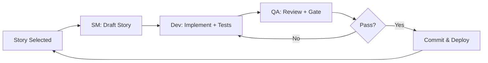

# Contractors Module Documentation

**Module**: Contractors Management
**Status**: Active Development (Rewrite Complete Oct 30, 2025)
**Last Updated**: October 30, 2025

---

## 🚨 CRITICAL: Vercel Routing Issue

**If you get 405 errors on contractor endpoints, read this first:**

👉 **[VERCEL_ROUTING_FIX.md](./VERCEL_ROUTING_FIX.md)** - Complete documentation of the Vercel dynamic route bug and solution

**TL;DR:** Dynamic routes like `/api/contractors/[id]` return 405 on Vercel. Use flat endpoints instead:
- ✅ `/api/contractors-update` (PUT with id in body)
- ✅ `/api/contractors-delete` (POST with id in body)
- ❌ `/api/contractors/[id]` (broken on Vercel)

**Last Verified:** October 30, 2025 - Working in production

---

## 📋 Quick Links

| Document | Purpose | Status |
|----------|---------|--------|
| **[⚠️ VERCEL_ROUTING_FIX.md](./VERCEL_ROUTING_FIX.md)** | **Vercel 405 bug & solution** | **✅ Critical** |
| [REWRITE_PLAN.md](./REWRITE_PLAN.md) | Complete module rewrite plan | ✅ Complete |
| [CLEANUP_SUMMARY.md](./CLEANUP_SUMMARY.md) | Old code removal summary | ✅ Complete |
| [MODULE_SEPARATION_ANALYSIS.md](./MODULE_SEPARATION_ANALYSIS.md) | Future module extraction | ✅ Complete |
| [Foundation Assessment](./foundation-assessment.md) | Original state analysis | ✅ Complete |
| [Product Requirements (PRD)](./prd.md) | What we're building | ✅ Complete |
| [Improvement Backlog](./improvement-backlog.md) | Prioritized work items | ⏳ Updated |

---

## 🎯 Module Overview

The Contractors module manages fiber network contractor relationships, including:

- **Contractor CRUD**: Create, read, update, delete contractor records
- **Team Management**: Organize contractors into specialized teams
- **Document Management**: Upload, verify, and track contractor documents
- **Onboarding**: Guide contractors through registration and approval
- **Compliance Tracking**: Monitor certifications, safety, and regulatory compliance
- **Performance Metrics**: RAG scoring across 5 dimensions
- **Applications**: Approve/reject contractor applications

---

## 📊 Current Status (Oct 24, 2025)

### Foundation Assessment Results

| Aspect | Grade | Notes |
|--------|-------|-------|
| Database Schema | ⭐⭐⭐⭐⭐ (5/5) | Excellent - 5 normalized tables, proper indexes |
| API Routes | ⭐⭐⭐⭐ (4/5) | Good - Some CRUD endpoints missing |
| Frontend Components | ⭐⭐⭐⭐ (4.5/5) | Very Good - Well organized, needs refactoring |
| Services Layer | ⭐⭐⭐⭐ (4/5) | Good - Some consolidation needed |
| Documentation | ⭐⭐⭐ (3.5/5) | Needs Work - Missing architecture docs |
| Test Coverage | ⭐⭐ (2/5) | Poor - Only ~20% coverage |
| Type System | ⭐⭐⭐⭐⭐ (5/5) | Excellent - Comprehensive types |
| **Overall** | **⭐⭐⭐⭐ (4/5)** | **Solid Foundation** |

### Key Strengths ✅
- Comprehensive database schema with proper normalization
- Well-organized component structure
- Type-safe TypeScript implementation
- Good separation of concerns
- Existing logging and error handling

### Improvement Areas ⚠️
- Missing API endpoints (team/document CRUD, RAG updates, onboarding)
- Low test coverage (~20%, target 80%+)
- API response format inconsistencies
- Large components exceeding 300 lines
- Duplicate code in ContractorDetailSections
- Missing architecture documentation

---

## 🚀 Improvement Roadmap

### Phase 1: API Completeness (Weeks 1-2)
**Priority**: P0 - Critical
**Effort**: 15-25 hours

- ✅ Complete team CRUD endpoints
- ✅ Complete document CRUD endpoints
- ✅ Add RAG score management
- ✅ Add onboarding stage management
- ✅ Standardize all API responses

### Phase 2: Quality & Testing (Weeks 3-4)
**Priority**: P1 - Important
**Effort**: 20-30 hours

- ✅ Add API route tests (100% coverage)
- ✅ Add service layer tests (90% coverage)
- ✅ Add component tests (70% coverage)
- ✅ Add E2E tests for critical workflows
- ✅ Set up CI/CD automation

### Phase 3: Code Quality (Weeks 5-6)
**Priority**: P1 - Important
**Effort**: 15-25 hours

- ✅ Consolidate contractor services
- ✅ Extract query builder
- ✅ Refactor large components
- ✅ Remove duplicate code
- ✅ Enable TypeScript strict mode

### Phase 4: Documentation & Polish (Weeks 7-8)
**Priority**: P2 - Enhancement
**Effort**: 10-15 hours

- ⏳ Create architecture documentation
- ⏳ Generate OpenAPI specs
- ⏳ Add JSDoc comments
- ⏳ Create component docs
- ⏳ Write developer guide

### Phase 5: Performance (Ongoing)
**Priority**: P2 - Enhancement
**Effort**: 15-20 hours

- ⏳ Add pagination
- ⏳ Optimize queries
- ⏳ Implement caching
- ⏳ Add virtual scrolling
- ⏳ Performance testing

**Total Estimated Effort**: 75-115 hours (10-14 working days)

---

## 📚 Using BMad Methodology

This module follows the **BMad (Agile AI-Driven)** development methodology.

### BMad Workflow for Contractors Module



### Story Development Cycle

1. **Scrum Master (SM)**: Drafts story from backlog with acceptance criteria
2. **Developer (Dev)**: Implements story with tests
3. **QA (Test Architect)**: Reviews code and creates quality gate
4. **Commit**: Merge and deploy when gate passes
5. **Repeat**: Move to next story

### BMad Commands (if using IDE integration)

```bash
# Scrum Master
@sm Draft next story from Epic 1

# Developer
@dev Implement Story 1.1 team CRUD endpoints

# QA (Test Architect)
@qa *review Story 1.1
@qa *trace Story 1.1
@qa *nfr Story 1.1
```

---

## 📁 Module Structure

```
docs/modules/contractors/
├── README.md                           # This file
├── VERCEL_ROUTING_FIX.md              # ⚠️ CRITICAL - Vercel 405 bug solution (Oct 30, 2025)
├── REWRITE_PLAN.md                    # Complete rewrite plan (Oct 30, 2025)
├── CLEANUP_SUMMARY.md                 # Old code removal summary (Oct 30, 2025)
├── MODULE_SEPARATION_ANALYSIS.md      # Future module extraction plan
├── foundation-assessment.md           # Original state analysis (Oct 24, 2025)
├── prd.md                             # Product requirements
├── improvement-backlog.md             # Prioritized stories
├── architecture.md                    # System architecture (TBD)
├── developer-guide.md                 # Developer onboarding (TBD)
├── api-spec.yaml                      # OpenAPI specification (TBD)
├── epics/                            # Sharded epic documents
├── stories/                          # Sharded story documents
└── qa/
    ├── assessments/                  # QA risk/design/trace/NFR docs
    └── gates/                        # Quality gate decisions
```

---

## 🛠️ Key Technologies

- **Backend**: Next.js 14+ API Routes (App Router)
- **Database**: Neon PostgreSQL (serverless)
- **Frontend**: React 18 + TypeScript + TailwindCSS
- **Testing**: Vitest (unit), Playwright (E2E)
- **Validation**: Zod schemas
- **Logging**: Custom logger (`@/lib/logger`)
- **Auth**: Clerk (planned)

---

## 🔗 Related Documentation

### Project-Level Docs
- [CLAUDE.md](../../../CLAUDE.md) - Project overview and standards
- [Page Logs](../../page-logs/contractors.md) - Historical changes and fixes
- [Database Schema](../../../scripts/migrations/create-contractors-tables.sql)
- [API Response Standards](../../../CLAUDE.md#api-response-standards)

### Code Locations (After Oct 30, 2025 Rewrite)

**App Router (Pages):**
- `app/contractors/page.tsx` - List page
- `app/contractors/new/page.tsx` - Create page
- `app/contractors/[id]/page.tsx` - View page
- `app/contractors/[id]/edit/page.tsx` - Edit page
- `app/layout.tsx` - Root layout

**API Routes (Flat Endpoints - Vercel Compatible):**
- `pages/api/contractors-update.ts` - Update endpoint (flat) ✅
- `pages/api/contractors-delete.ts` - Delete endpoint (flat) ✅
- `app/api/contractors/route.ts` - List/Create (App Router) ✅
- ~~`pages/api/contractors/[id].ts`~~ - ❌ Broken on Vercel (dynamic route)

**Components:**
- `src/components/contractors/ContractorsList.tsx` - Client component for list
- `src/components/contractors/ContractorForm.tsx` - Shared form component

**Types:**
- `src/types/contractor.core.types.ts` - Core types (18 fields)

**Documentation:**
- `docs/modules/contractors/` - All module documentation
- `docs/page-logs/contractors.md` - Historical change log

---

## 👥 Stakeholders

| Role | Responsibility | Contact |
|------|---------------|---------|
| Product Owner | PRD approval, story validation | TBD |
| Technical Lead | Architecture decisions | TBD |
| QA Lead | Test strategy, quality gates | TBD |
| Operations Manager | Requirements, UAT | TBD |

---

## 📈 Success Metrics

### Technical KPIs
- **Test Coverage**: >80% (current: ~20%)
- **API Response Time**: <200ms p95
- **Build Time**: <2 minutes
- **Zero Critical Bugs**: No P0 issues in production

### User KPIs
- **Time to Create Contractor**: <2 minutes
- **Document Upload Success Rate**: >99%
- **Onboarding Completion Rate**: >90%
- **User Error Rate**: <5%

---

## 🚦 Getting Started

### For New Developers

1. **Read this README** - Understand module overview
2. **Review Foundation Assessment** - Understand current state
3. **Read PRD** - Understand what we're building
4. **Check Backlog** - See what's coming next
5. **Set up environment** - Follow main project README
6. **Pick a story** - Start with P2 stories for onboarding

### For Continuing Work

1. **Check Backlog** - Find next priority story
2. **Use BMad Workflow** - SM → Dev → QA
3. **Write Tests First** - TDD approach preferred
4. **Follow Standards** - See CLAUDE.md
5. **Update Docs** - Keep this README current

---

## 📝 Contributing

### Before Starting Work
- [ ] Read PRD and understand the story
- [ ] Check for dependencies on other stories
- [ ] Review acceptance criteria
- [ ] Estimate effort

### During Development
- [ ] Follow coding standards (CLAUDE.md)
- [ ] Write tests (TDD preferred)
- [ ] Keep files <300 lines
- [ ] Use TypeScript strictly
- [ ] Add JSDoc comments

### Before Submitting
- [ ] All tests pass
- [ ] Test coverage maintained/improved
- [ ] No linting errors
- [ ] API responses standardized
- [ ] Documentation updated
- [ ] Page log updated (if fixing bugs)

---

## 📞 Questions or Issues?

- **Technical questions**: Check [Developer Guide](./developer-guide.md) (when created)
- **Process questions**: See [BMad User Guide](../../../.bmad-core/user-guide.md) (if BMad installed)
- **Bug reports**: Create issue with "contractors" label
- **Feature requests**: Add to backlog with justification

---

**Last Updated**: October 30, 2025 (Rewrite Complete + Vercel Fix)
**Next Review**: November 13, 2025 (2 weeks)
**Critical Fix**: Vercel routing workaround implemented and verified in production
