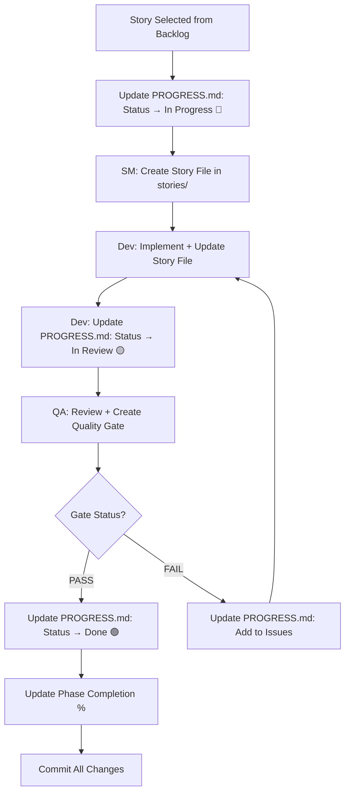

# Contractors Module - Progress Tracking Guide

**Purpose**: Understand how to track progress using BMad + manual tracking
**Last Updated**: October 24, 2025

---

## 📊 Progress Tracking Overview

Progress tracking in the Contractors module uses **three interconnected systems**:

1. **PROGRESS.md** - High-level status dashboard (manual updates)
2. **BMad Quality Gates** - Story-level quality tracking (automated by QA)
3. **BMad Story Files** - Detailed story implementation (auto-generated)

---

## 🎯 The Three Tracking Layers

### Layer 1: PROGRESS.md (Strategic View)

**Purpose**: Executive summary, sprint tracking, milestone progress
**Location**: `docs/modules/contractors/PROGRESS.md`
**Update Frequency**: After each story completion
**Audience**: Product owners, stakeholders, team leads

**What it tracks**:
- Overall module completion (X/25 stories)
- Phase-by-phase progress
- Sprint goals and daily updates
- Burndown charts
- Key milestones
- Quality metrics (test coverage, code quality)

**Example Entry**:
```markdown
| Story | Status | Assignee | Est. Hours | Actual | Quality Gate |
|-------|--------|----------|------------|--------|--------------|
| 1.1: Team CRUD | 🟢 Done | @dev | 3-5h | 4.2h | PASS ✅ |
```

---

### Layer 2: BMad Quality Gates (Story Quality View)

**Purpose**: Track quality decisions for each completed story
**Location**: `docs/modules/contractors/qa/gates/`
**Update Frequency**: Automatically created by QA agent after review
**Audience**: Developers, QA team

**What it tracks**:
- Quality gate decision (PASS/CONCERNS/FAIL/WAIVED)
- Issues found and their severity
- Test coverage gaps
- Risk assessment
- Recommendations for improvements

**File Format**: YAML (structured, machine-readable)
**Naming**: `{epic}.{story}-{slug}.yml`

**Example**: `1.1-team-crud.yml`
```yaml
schema: 1
story: "1.1"
story_title: "Implement Team CRUD Endpoints"
gate: "PASS"
status_reason: "All acceptance criteria met, comprehensive tests added"
reviewer: "Quinn (Test Architect)"
updated: "2025-10-25T14:30:00Z"

top_issues: []

risk_summary:
  totals: { critical: 0, high: 0, medium: 1, low: 2 }
  recommendations:
    must_fix: []
    monitor:
      - "Consider adding rate limiting to prevent abuse"
```

---

### Layer 3: BMad Story Files (Implementation Details)

**Purpose**: Detailed story specification and implementation notes
**Location**: `docs/modules/contractors/stories/`
**Update Frequency**: Created before implementation, updated during
**Audience**: Developers implementing the story

**What it tracks**:
- Full acceptance criteria
- Implementation approach
- Files modified
- Tests written
- Notes and decisions
- Links to related stories

**File Format**: Markdown
**Naming**: `epic-{num}/story-{num}-{slug}.md`

**Example**: `stories/epic-1/story-1.1-team-crud.md`
```markdown
# Story 1.1: Implement Team CRUD Endpoints

**Epic**: 1 - API Completeness
**Priority**: P0
**Points**: 3
**Status**: Done ✅

## Acceptance Criteria
- [x] PUT /api/contractors/[id]/teams/[teamId] implemented
- [x] DELETE /api/contractors/[id]/teams/[teamId] implemented
...

## Implementation Notes
- Used apiResponse helper for standardized responses
- Added validation for team_type enum
- Test coverage: 100% for new endpoints

## Quality Gate
- Status: PASS ✅
- Gate File: `qa/gates/1.1-team-crud.yml`
```

---

## 🔄 How the Layers Work Together

### Story Lifecycle & Tracking



---

## 📝 How to Track Progress (Step-by-Step)

### When Starting a Story

**1. Update PROGRESS.md**
```markdown
# Change story status from ⬜ to 🔵
| 1.1: Team CRUD | 🔵 In Progress | @yourname | 3-5h | - | - |
```

**2. Update Current Sprint Section**
```markdown
### Sprint Backlog
- [🔵] Story 1.1: Team CRUD Endpoints (in progress)
  - [x] Create API route file
  - [ ] Implement PUT endpoint
  - [ ] Implement DELETE endpoint
```

**3. (Optional) Create Story File**
```bash
# If using BMad SM agent
@sm Draft Story 1.1 from improvement backlog

# Or manually create:
# docs/modules/contractors/stories/epic-1/story-1.1-team-crud.md
```

---

### During Development

**Update Story File** (if created)
```markdown
## Implementation Progress
- [x] Created pages/api/contractors/[contractorId]/teams/[teamId].ts
- [x] Added PUT handler
- [x] Added DELETE handler
- [ ] Writing tests
```

**Daily Update in PROGRESS.md**
```markdown
### Daily Updates
**Oct 25, 2025**:
- Completed PUT and DELETE endpoints for team management
- Added input validation
- Writing tests (50% complete)
- Estimated 2 more hours to completion
```

---

### When Completing a Story

**1. Mark Story as Ready for Review**
```markdown
# Update PROGRESS.md
| 1.1: Team CRUD | 🟡 In Review | @yourname | 3-5h | 4.2h | Pending |
```

**2. Request QA Review**
```bash
# If using BMad QA agent
@qa *review Story 1.1

# This will:
# - Review your code
# - Check test coverage
# - Validate acceptance criteria
# - Create quality gate file in qa/gates/1.1-team-crud.yml
```

**3. After QA Review, Update PROGRESS.md**
```markdown
# Update with gate result
| 1.1: Team CRUD | 🟢 Done | @yourname | 3-5h | 4.2h | PASS ✅ |

# Update phase completion
**Phase Completion**: ██░░░░░░░░ 20% (1/5 stories)

# Update overall progress
Progress: [███░░░░░░░░░░░░░░░░░] 12% (3/25 stories)
```

**4. Update Weekly Summary**
```markdown
### Week 1 (Oct 24 - Oct 31, 2025)

**Completed**:
- ✅ Story 1.1: Team CRUD Endpoints (4.2h actual vs 3-5h estimate)
  - Quality Gate: PASS ✅
  - Test Coverage: 100% for new code
  - No issues found
```

---

### If Story Fails QA

**1. Update PROGRESS.md with Issues**
```markdown
| 1.1: Team CRUD | 🔴 Blocked | @yourname | 3-5h | 4.2h | FAIL ❌ |

## Issues & Blockers
### Active Blockers
- **Story 1.1**: Missing test coverage for error cases (QA review)
  - See: qa/gates/1.1-team-crud.yml for details
  - Action: Add tests for 400, 404 responses
```

**2. Fix Issues and Re-request Review**
```bash
# After fixing
@qa *gate Story 1.1  # Update gate status
```

---

## 🎯 BMad-Specific Tracking Features

### Quality Gates (Automated)

BMad QA agent automatically creates quality gate files when you run:
```bash
@qa *review {story}
```

**Gate File Location**: `docs/modules/contractors/qa/gates/{epic}.{story}-{slug}.yml`

**Gate Statuses**:
- **PASS** ✅ - All criteria met, ready to deploy
- **CONCERNS** ⚠️ - Minor issues, deploy with caution
- **FAIL** ❌ - Critical issues, must fix before deploy
- **WAIVED** 🔄 - Issues accepted, documented reason required

**Reading a Gate File**:
```yaml
gate: "PASS"
status_reason: "All acceptance criteria met"

top_issues:
  - id: "PERF-001"
    severity: low
    finding: "Query could be optimized with index"
    suggested_action: "Add index to team_id column (future optimization)"
```

---

### QA Assessments (Optional, Deep Dives)

For high-risk stories, QA can create additional assessments:

**Risk Profile** (`@qa *risk {story}`):
- Location: `qa/assessments/{epic}.{story}-risk-{date}.md`
- Identifies implementation risks before coding
- Scores risks by probability × impact

**Test Design** (`@qa *design {story}`):
- Location: `qa/assessments/{epic}.{story}-test-design-{date}.md`
- Creates comprehensive test strategy
- Defines what tests to write (unit/integration/E2E)

**Requirements Trace** (`@qa *trace {story}`):
- Location: `qa/assessments/{epic}.{story}-trace-{date}.md`
- Maps acceptance criteria to tests
- Identifies coverage gaps

**NFR Assessment** (`@qa *nfr {story}`):
- Location: `qa/assessments/{epic}.{story}-nfr-{date}.md`
- Validates non-functional requirements
- Checks security, performance, reliability, maintainability

---

## 📊 Tracking Dashboards

### Quick Status Check

**At a glance**:
```bash
# View overall progress
cat docs/modules/contractors/PROGRESS.md | grep "Progress:"

# View current sprint
cat docs/modules/contractors/PROGRESS.md | grep -A 20 "Current Sprint"

# Check recent quality gates
ls -lt docs/modules/contractors/qa/gates/ | head -5
```

**Using grep for story status**:
```bash
# Find all in-progress stories
grep "🔵 In Progress" docs/modules/contractors/PROGRESS.md

# Find all blocked stories
grep "🔴 Blocked" docs/modules/contractors/PROGRESS.md

# Count completed stories
grep "🟢 Done" docs/modules/contractors/PROGRESS.md | wc -l
```

---

### Weekly Review Template

**Every Friday** (or end of sprint):

1. **Open PROGRESS.md** and update:
   - [ ] Story statuses
   - [ ] Actual hours vs estimates
   - [ ] Phase completion percentages
   - [ ] Overall progress bar
   - [ ] Weekly update section

2. **Review Quality Gates**:
   - [ ] Count PASS/CONCERNS/FAIL gates
   - [ ] Identify patterns in issues
   - [ ] Update quality metrics

3. **Update Velocity**:
   - [ ] Calculate actual hours worked
   - [ ] Compare to estimated velocity
   - [ ] Adjust next sprint estimates

4. **Check Milestones**:
   - [ ] Are we on track?
   - [ ] Any timeline adjustments needed?
   - [ ] Communicate risks/delays

---

## 🛠️ Tools & Scripts (Optional)

### Create a Progress Update Script

**File**: `scripts/update-progress.sh`
```bash
#!/bin/bash
# Quick script to update story status

STORY=$1
STATUS=$2  # pending, in_progress, in_review, done, blocked

# Update PROGRESS.md with new status
# (You'd implement sed/awk logic here)

echo "Updated Story $STORY to $STATUS"
```

### Quality Gate Summary Script

**File**: `scripts/gate-summary.sh`
```bash
#!/bin/bash
# Summarize all quality gates

GATES_DIR="docs/modules/contractors/qa/gates"

echo "Quality Gate Summary"
echo "===================="

for gate in $GATES_DIR/*.yml; do
  STATUS=$(grep "^gate:" "$gate" | cut -d'"' -f2)
  STORY=$(grep "^story:" "$gate" | cut -d'"' -f2)
  echo "Story $STORY: $STATUS"
done
```

---

## 📅 Tracking Cadence

### Daily (During Active Development)
- Update story progress in PROGRESS.md
- Add daily notes on what was accomplished
- Flag any blockers immediately

### Weekly (Every Friday)
- Complete weekly update section
- Review and update all metrics
- Adjust sprint plans if needed
- Review quality gate trends

### Monthly (End of Month)
- Milestone review
- Success criteria check
- Retrospective on process
- Plan adjustments for next month

---

## 🎯 What to Track & When

| **What** | **Where** | **When** | **Who** |
|----------|-----------|----------|---------|
| Story status | PROGRESS.md | Start/End/Block | Developer |
| Daily progress | PROGRESS.md | Daily | Developer |
| Quality gate | qa/gates/ | After review | QA Agent |
| Test coverage | PROGRESS.md | After testing | Developer |
| Sprint goals | PROGRESS.md | Start of sprint | Team |
| Weekly velocity | PROGRESS.md | End of week | Team Lead |
| Milestones | PROGRESS.md | Weekly | Product Owner |
| Issues/blockers | PROGRESS.md | As they occur | Anyone |

---

## 💡 Best Practices

### Do's ✅
- ✅ Update PROGRESS.md immediately when story status changes
- ✅ Be honest about actual hours (helps improve estimates)
- ✅ Document blockers as soon as they occur
- ✅ Review quality gates before marking story done
- ✅ Keep daily updates brief but informative
- ✅ Commit PROGRESS.md with your story commits

### Don'ts ❌
- ❌ Don't skip updating progress (leads to confusion)
- ❌ Don't delete quality gate files (audit trail)
- ❌ Don't mark stories done without QA review
- ❌ Don't let PROGRESS.md get stale (update weekly minimum)
- ❌ Don't ignore quality gate FAIL/CONCERNS

---

## 🔍 Troubleshooting Progress Tracking

### "I forgot to update PROGRESS.md"
**Solution**: Reconstruct from git history
```bash
git log --oneline --grep="Story 1.1" --all
# Review commits to see when story was started/completed
```

### "Quality gate file is missing"
**Solution**: Request QA review again
```bash
@qa *review Story 1.1
# Or manually create gate file using template
cp .bmad-core/templates/qa-gate-tmpl.yaml qa/gates/1.1-story.yml
```

### "Progress doesn't match actual work"
**Solution**: Weekly reconciliation
- Review all git commits from the week
- Update PROGRESS.md to reflect actual state
- Adjust estimates for remaining stories

---

## 📖 Related Documentation

- [PROGRESS.md](./PROGRESS.md) - Current progress dashboard
- [improvement-backlog.md](./improvement-backlog.md) - Full story backlog
- [prd.md](./prd.md) - Requirements and success criteria
- [BMad User Guide](../../../.bmad-core/user-guide.md) - Full BMad workflow

---

**Quick Start**:
1. Read this guide
2. Open PROGRESS.md
3. Pick a story from backlog
4. Update PROGRESS.md: ⬜ → 🔵
5. Implement the story
6. Request QA review: `@qa *review {story}`
7. Update PROGRESS.md: 🔵 → 🟢 (or 🔴 if blocked)
8. Repeat!

---

**Last Updated**: October 24, 2025
**Questions?**: See BMad User Guide or ask in team chat
