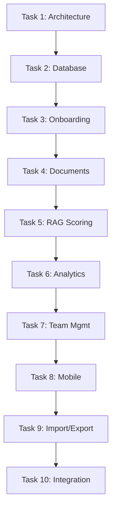

# Contractor Management Enhancement Tasks

## Task Breakdown

### Task 1: Development Environment & Architecture Setup
- **Title**: Initialize Contractor Module Architecture
- **Description**: Set up the foundational architecture for enhanced contractor management including service layer, type definitions, and testing framework.
- **Priority**: High
- **Estimate**: 8 hours
- **Phase**: Phase 1
- **Dependencies**: None (Starting task)
- **Acceptance Criteria**:
  - [ ] Create `src/modules/contractors/services/` directory with base service structure
  - [ ] Create `src/modules/contractors/types/` directory with TypeScript definitions
  - [ ] Set up `__tests__/` directory with testing configuration
  - [ ] Create base service classes following project constitution patterns
  - [ ] Establish proper imports/exports for module organization
  - [ ] Verify all new files pass TypeScript strict mode compilation

### Task 2: Database Schema Enhancement
- **Title**: Implement Enhanced Database Schema for Contractors
- **Description**: Create and execute database migrations for enhanced contractor features including onboarding stages, team members, and performance tracking.
- **Priority**: High
- **Estimate**: 6 hours
- **Phase**: Phase 1
- **Dependencies**: Task 1 (Architecture setup)
- **Acceptance Criteria**:
  - [ ] Create migration script for contractor_onboarding_stages table
  - [ ] Create migration script for contractor_team_members table
  - [ ] Add performance indexes for RAG scoring queries
  - [ ] Execute migrations successfully in development environment
  - [ ] Verify data integrity with existing contractor records
  - [ ] Create rollback procedures for all new schema changes

### Task 3: Multi-Stage Onboarding Workflow System
- **Title**: Build Multi-Stage Contractor Onboarding System
- **Description**: Implement the enhanced onboarding workflow with progress tracking, stage management, and automated notifications.
- **Priority**: High
- **Estimate**: 16 hours
- **Phase**: Phase 1
- **Dependencies**: Task 2 (Database schema)
- **Acceptance Criteria**:
  - [ ] Create OnboardingWizard component with step-by-step interface
  - [ ] Implement StageProgress component with visual progress indicators
  - [ ] Build onboarding service with stage management logic
  - [ ] Create automated email notifications for stage transitions
  - [ ] Implement progress persistence and recovery
  - [ ] Add comprehensive error handling and user feedback

### Task 4: Document Management & Approval System
- **Title**: Enhanced Document Upload and Approval Workflow
- **Description**: Build a comprehensive document management system with upload, approval, rejection, and bulk operations for contractor documentation.
- **Priority**: High
- **Estimate**: 12 hours
- **Phase**: Phase 1
- **Dependencies**: Task 3 (Onboarding system)
- **Acceptance Criteria**:
  - [ ] Create DocumentUpload component with drag-and-drop functionality
  - [ ] Implement file validation (size, type, security scanning)
  - [ ] Build approval workflow with admin interface
  - [ ] Create bulk document operations for administrators
  - [ ] Implement document history and audit trail
  - [ ] Add secure file storage integration with Firebase Storage

### Task 5: Advanced RAG Scoring Algorithm
- **Title**: Implement 4-Dimensional RAG Scoring System
- **Description**: Create an intelligent RAG scoring system with real-time calculations, historical tracking, and automated updates based on contractor performance data.
- **Priority**: High
- **Estimate**: 20 hours
- **Phase**: Phase 2
- **Dependencies**: Task 4 (Document management)
- **Acceptance Criteria**:
  - [ ] Implement RAG scoring algorithm with 4 weighted dimensions
  - [ ] Create real-time score calculation service
  - [ ] Build historical tracking with complete audit trail
  - [ ] Implement automated score updates on data changes
  - [ ] Create RAG score visualization components
  - [ ] Add performance optimization for large datasets

### Task 6: Performance Analytics Dashboard
- **Title**: Build Comprehensive Performance Analytics System
- **Description**: Create a performance monitoring and analytics dashboard with real-time metrics, health checks, and automated alerting for contractor management operations.
- **Priority**: Medium
- **Estimate**: 14 hours
- **Phase**: Phase 2
- **Dependencies**: Task 5 (RAG scoring)
- **Acceptance Criteria**:
  - [ ] Create PerformanceDashboard component with real-time metrics
  - [ ] Implement system health monitoring with API endpoint checks
  - [ ] Build error tracking and reporting system
  - [ ] Create automated alerting for performance issues
  - [ ] Add export functionality for analytics reports
  - [ ] Implement caching for performance optimization

### Task 7: Team Management & Capacity Planning
- **Title**: Implement Team Management and Resource Planning System
- **Description**: Build comprehensive team management features including member profiles, certification tracking, capacity planning, and specialization mapping.
- **Priority**: Medium
- **Estimate**: 18 hours
- **Phase**: Phase 3
- **Dependencies**: Task 6 (Analytics dashboard)
- **Acceptance Criteria**:
  - [ ] Create TeamBuilder component for team composition
  - [ ] Implement MemberProfiles with certification tracking
  - [ ] Build CapacityPlanner with availability management
  - [ ] Create specialization mapping interface
  - [ ] Implement team analytics and reporting
  - [ ] Add capacity utilization tracking and alerts

### Task 8: Mobile Responsiveness & Optimization
- **Title**: Mobile Interface Optimization for All Contractor Features
- **Description**: Optimize all contractor management interfaces for mobile devices with touch-friendly controls, responsive layouts, and performance optimization.
- **Priority**: Medium
- **Estimate**: 16 hours
- **Phase**: Phase 3
- **Dependencies**: Task 7 (Team management)
- **Acceptance Criteria**:
  - [ ] Create mobile-optimized versions of key components
  - [ ] Implement touch-friendly interface controls
  - [ ] Optimize performance for mobile devices (<2s load times)
  - [ ] Test responsiveness across 5+ different device sizes
  - [ ] Implement offline capability for key contractor operations
  - [ ] Add mobile-specific navigation and interaction patterns

### Task 9: Import/Export & Bulk Operations
- **Title**: Enhanced Data Import/Export and Bulk Operations
- **Description**: Implement robust bulk data operations with support for large files, data validation, progress tracking, and error handling.
- **Priority**: Medium
- **Estimate**: 12 hours
- **Phase**: Phase 4
- **Dependencies**: Task 8 (Mobile optimization)
- **Acceptance Criteria**:
  - [ ] Support CSV/Excel import up to 50MB file size
  - [ ] Implement comprehensive data validation and duplicate detection
  - [ ] Create progress tracking for large batch operations
  - [ ] Build error reporting and partial failure handling
  - [ ] Add export functionality with filtering and formatting options
  - [ ] Implement background processing for large operations

### Task 10: Integration Testing & Performance Optimization
- **Title**: System Integration and Performance Validation
- **Description**: Conduct comprehensive integration testing, performance optimization, and security validation for the enhanced contractor management system.
- **Priority**: High
- **Estimate**: 14 hours
- **Phase**: Phase 4
- **Dependencies**: Task 9 (Import/Export)
- **Acceptance Criteria**:
  - [ ] Complete end-to-end testing of all contractor workflows
  - [ ] Validate API response times meet <250ms requirement (p95)
  - [ ] Conduct security audit and vulnerability assessment
  - [ ] Perform load testing with realistic data volumes
  - [ ] Optimize database queries and implement caching where needed
  - [ ] Verify all constitution compliance requirements are met

## Overall Timeline

### Sprint Planning
- **Sprint 1 (Week 1-2)**: Tasks 1-4 (Foundation & Onboarding)
- **Sprint 2 (Week 3-4)**: Tasks 5-6 (RAG Scoring & Analytics)
- **Sprint 3 (Week 5-6)**: Tasks 7-8 (Team Management & Mobile)
- **Sprint 4 (Week 7-8)**: Tasks 9-10 (Integration & Optimization)

### Milestone Dependencies

## Resources Needed

### Development Resources
- [ ] **Lead Full-Stack Developer** (120h) - Overall implementation and architecture
- [ ] **Frontend Specialist** (60h) - Component development and mobile optimization  
- [ ] **Database Engineer** (20h) - Schema design and query optimization
- [ ] **QA Engineer** (40h) - Testing and quality assurance
- [ ] **UX Designer** (20h) - Mobile interface design and user experience

### Technical Resources
- [ ] **Development Environment** - Enhanced with contractor module testing setup
- [ ] **Testing Framework** - Vitest, React Testing Library, Playwright for e2e
- [ ] **Performance Monitoring** - Real-time analytics and alerting tools
- [ ] **Mobile Testing Devices** - Range of devices for responsive testing
- [ ] **Database Tools** - Migration scripts and performance monitoring

### Documentation Resources
- [ ] **Technical Documentation** - API documentation, component guides
- [ ] **User Guides** - End-user documentation and training materials
- [ ] **Testing Documentation** - Test plans and coverage reports
- [ ] **Performance Reports** - Benchmark results and optimization guides

## Quality Assurance

### Code Quality Standards
- All code must pass TypeScript strict mode compilation
- ESLint must pass with zero warnings
- Components must remain under 200 lines per constitution
- Business logic must be extracted to custom hooks
- All database queries must use parameterized statements

### Testing Requirements
- Unit test coverage must exceed 95% for new functionality
- Integration tests must cover all new API endpoints
- End-to-end tests must cover complete contractor workflows
- Performance tests must validate <250ms API response requirements
- Mobile testing must cover 5+ different device configurations

### Performance Benchmarks
- API responses must complete in <250ms (95th percentile)
- Page load times must be <1.5 seconds
- Mobile performance must match desktop benchmarks
- Database queries must be optimized with proper indexing
- System must maintain 99.9% availability during normal operations

## Risk Mitigation

### Technical Risks
- **Database Migration Complexity**: Comprehensive backup and rollback procedures
- **Performance Degradation**: Staged rollout with performance monitoring
- **Mobile Compatibility Issues**: Progressive enhancement and device testing
- **Integration Conflicts**: Early integration testing and stakeholder communication

### Timeline Risks
- **Scope Creep**: Clear acceptance criteria and change management process
- **Resource Availability**: Cross-training and knowledge sharing protocols
- **Technical Blockers**: Regular risk assessment and escalation procedures
- **Quality Issues**: Continuous testing and quality gates at each phase

---

**Generated**: 2025-12-28 | **Status**: Ready for assignment | **Total Effort**: 136 hours

**Immediate Actions Required**:
1. Assign development team roles and responsibilities
2. Set up project tracking and communication channels  
3. Create detailed user stories for each task
4. Schedule regular review and demo sessions
5. Begin Task 1 implementation with architecture setup